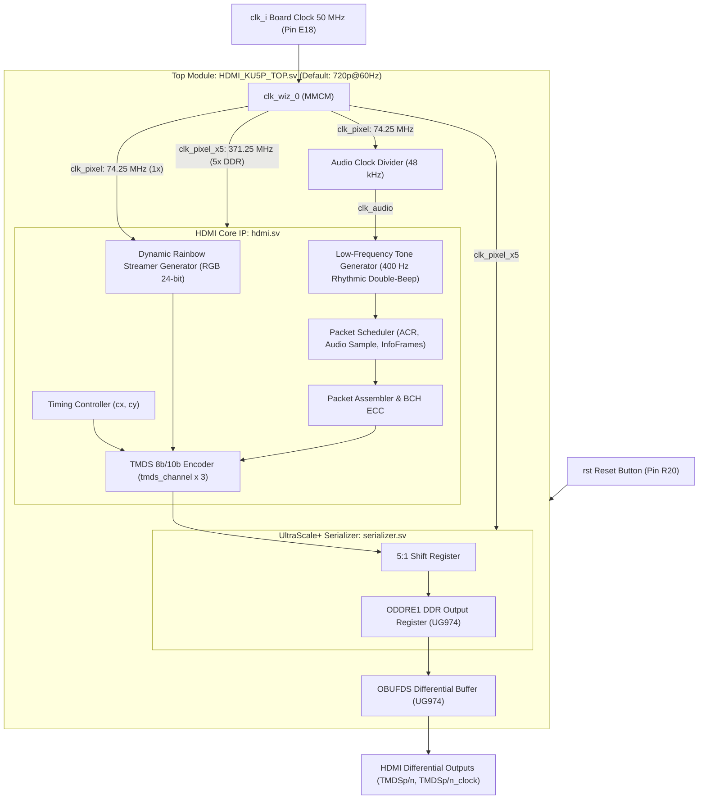

[English](README.md) | [繁體中文](README_zh-TW.md)

# AMD Kintex UltraScale+ (KU5P) HDMI Transmitter Controller

A complete HDMI 1.4 transmitter controller tailored for **AMD / Xilinx Kintex UltraScale+ (KU5P)** FPGA development boards. Configured by default for **1280x720p @ 60Hz** output, it features **standard HDMI Data Island packet transmission**, **48 kHz 16-bit 2-channel L-PCM audio**, an **animated neon rainbow flowing light (Streamer) test pattern**, and a high-performance **5x DDR serialization pipeline** utilizing native UltraScale+ I/O primitives (`ODDRE1` and `OBUFDS`).

---

## Demo Preview


---

## System Architecture



---

## Default Resolution & Clock Architecture (`clk_wiz_0`)

The project defaults to **1280x720p @ 60Hz** (CEA-861 Video Identification Code VIC = 4). This resolution provides excellent compatibility across HDMI monitors and TV displays while ensuring comfortable timing closure on Kintex UltraScale+ devices.

### Why 5x Serial Clock (Instead of 10x)?
* HDMI TMDS encodes each 8-bit color byte into a **10-bit** symbol.
* Traditional Single Data Rate (SDR) serialization would require a 10x clock (74.25 MHz × 10 = 742.5 MHz), which is prone to routing congestion, severe high-frequency attenuation, and high dynamic power consumption.
* This project leverages the dedicated UltraScale+ **`ODDRE1` (Double Data Rate Output Register)** primitive:
  * Bit 0 is driven on the **rising edge** of `clk_pixel_x5`, and Bit 1 is driven on the **falling edge** (transmitting 2 bits per clock cycle).
  * Consequently, serializing a 10-bit TMDS symbol requires only 5 clock cycles:

$$
f_{\text{serial}} = \frac{10\text{ bits}}{2\text{ bits/cycle}} \times f_{\text{pixel}} = 5 \times 74.25\text{ MHz} = 371.250\text{ MHz}
$$

---

## Default Specifications

| Parameter | Value | Description |
| :--- | :--- | :--- |
| **Video Resolution** | **1280 x 720p @ 60 Hz (Default)** | CEA-861 VIC = 4 (1650 × 750 total frame) |
| **Pixel Clock (`clk_pixel`)** | **74.250 MHz** | Generated by `clk_wiz_0` (1x clock) |
| **Serial Clock (`clk_pixel_x5`)** | **371.250 MHz** | Generated by `clk_wiz_0` (5x DDR serial clock) |
| **Video Pattern** | **Dynamic Flowing Light (Streamer)** | 26° diagonal rainbow wave with sweeping luminous shimmer |
| **Audio Format** | **2-Channel L-PCM (Stereo)** | 16-bit depth, CEA-861 compliant Audio InfoFrame |
| **Audio Sample Rate** | **48 kHz** | Derived from 74.25 MHz clock via 1548 divider (< 0.08% error) |
| **Audio Test Tone** | **400 Hz Rhythmic Double-Beep** | 1.0s period (200ms tone - 200ms rest - 200ms tone - 400ms silence) |

---

## Repository Directory Structure

```text
KU5P_HDMI/
├── demo.gif                            # Animated demonstration preview
├── pin.xdc                             # KU5P FPGA pin & I/O standard constraints
├── README.md                           # English documentation (Homepage)
├── README_zh-TW.md                     # Traditional Chinese documentation
├── top/
│   └── HDMI_KU5P_TOP.sv                # KU5P top-level module (clocks, pattern, audio integration)
├── src/                                # HDMI Core RTL source files (KU5P-dedicated)
│   ├── hdmi.sv                         # Top HDMI protocol controller
│   ├── serializer.sv                   # UltraScale+ ODDRE1 5x DDR serializer
│   ├── tmds_channel.sv                 # TMDS 8b/10b encoder
│   ├── packet_assembler.sv             # Data Island ECC/BCH packet assembler
│   ├── packet_picker.sv                # Packet scheduler (ACR, Audio Sample, InfoFrames)
│   ├── audio_clock_regeneration_packet.sv # Audio Clock Regeneration (N / CTS calculation)
│   ├── audio_sample_packet.sv          # IEC 60958 L-PCM audio sample packetizer
│   ├── audio_info_frame.sv             # CEA-861 Audio InfoFrame
│   ├── auxiliary_video_information_info_frame.sv # AVI InfoFrame (HDMI mode flag)
│   └── source_product_description_info_frame.sv  # SPD InfoFrame (source device identity)
└── sim/                                # Simulation testbench environment
    ├── clk_wiz_0_mock.sv               # Behavioral mock model for Clocking Wizard
    └── HDMI_KU5P_TOP_tb.sv             # Top-level functional verification testbench
```

---

## Pinout Mapping (`pin.xdc`)

| Port Name | Direction | I/O Standard | Pin Location | Description |
| :--- | :---: | :--- | :---: | :--- |
| **`clk_i`** | Input | `LVCMOS18` | **E18** | On-board 50 MHz reference oscillator |
| **`rst`** | Input | `LVCMOS18` | **R20** | Active-High push button reset |
| **`HDMI0_OE`** | Output | `LVCMOS33` | **Y16** | On-board HDMI level shifter buffer enable (`1'b1`) |
| **`LED`** | Output | `LVCMOS18` | **D18** | Heartbeat diagnostic LED (~2.2 Hz blink) |
| **`TMDSp[0]` / `TMDSn[0]`** | Output | `LVDS` | **N24** | TMDS Data Channel 0 (Blue / HSYNC / VSYNC) |
| **`TMDSp[1]` / `TMDSn[1]`** | Output | `LVDS` | **V24** | TMDS Data Channel 1 (Green) |
| **`TMDSp[2]` / `TMDSn[2]`** | Output | `LVDS` | **V23** | TMDS Data Channel 2 (Red) |
| **`TMDSp_clock` / `TMDSn_clock`** | Output | `LVDS` | **T25** | TMDS Clock Channel differential pair |

---

## Vivado Project Setup & Build Steps

1. **Create Vivado Project**:
   * Open Vivado and create a new RTL Project. Select your Kintex UltraScale+ FPGA part (e.g. `xcku5p-ffvb676-2-e` or corresponding target device).
2. **Add Source Files**:
   * Add `top/HDMI_KU5P_TOP.sv`.
   * Add all `.sv` files inside `src/`.
   * Add `pin.xdc` as the design constraint.
3. **Generate Clocking Wizard IP (`clk_wiz_0`)**:
   * Open **IP Catalog** and search for **Clocking Wizard**.
   * Set Component Name to **`clk_wiz_0`**.
   * **Input Clock**: Frequency = `50.000 MHz`, Source = `Single ended clock`.
   * **Output Clocks**:
     * `clk_out1`: Frequency = **`74.250 MHz`** (drives `clk_pixel`).
     * `clk_out2`: Frequency = **`371.250 MHz`** (drives `clk_pixel_x5`).
   * Uncheck `Reset` and `Locked` ports (handled directly by top-level logic).
4. **Generate Bitstream**:
   * Click **Run Synthesis** → **Run Implementation** → **Generate Bitstream**.
   * Program the generated `.bit` file to the FPGA board. Connect an HDMI cable to a TV or monitor to see the smooth rainbow flowing streamer and hear the 400 Hz double-beep chime!
