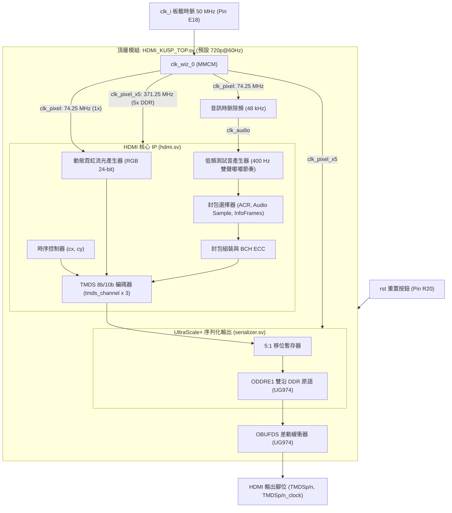

[English](README.md) | [繁體中文](README_zh-TW.md)

# AMD Kintex UltraScale+ (KU5P) HDMI 控制器與音訊發送系統

本專案為適用於 **AMD / Xilinx Kintex UltraScale+ (KU5P)** FPGA 開發板的完整 HDMI 1.4 發送端控制器，預設採用 **1280x720p @ 60Hz** 高畫質輸出，具備 **標準 HDMI Data Island 輔助資料島傳輸**、**48 kHz L-PCM 雙聲道音訊輸出**、**動態霓虹流光（Flowing Light）測試畫面**，以及基於 UltraScale+ 專用原語（`ODDRE1` 與 `OBUFDS`）的高速 5x DDR TMDS 序列化架構。

---

## 畫面展示 (Demo)


---

## 系統架構



---

## 預設規格與時脈產生機制 (`clk_wiz_0`)

本專案**預設啟用 1280x720p @ 60Hz**（CEA-861 VIC = 4）。此解析度相容於現今所有 HDMI 螢幕與電視，且時脈頻率適中、易於時序收斂（Timing Closure）。

### 為什麼序列化時脈是 5x 時脈（而非 10x）？
* HDMI TMDS 協議每筆畫素資料由 8-bit 編碼為 **10-bit** 傳送。
* 若採用傳統 SDR（單邊沿觸發）串列輸出，需要 10 倍時脈（74.25 MHz × 10 = 742.5 MHz），高頻時脈在 FPGA 走線與 I/O 容易引發嚴重的信號完整性與時序收斂問題。
* 本設計採用 Kintex UltraScale+ 專用 I/O 邏輯原語 **`ODDRE1` (Double Data Rate Output Register)**：
  * 在 `clk_pixel_x5` 的**上升沿**輸出 Bit 0，在**下降沿**輸出 Bit 1（每個時脈週期可輸出 2 個 bits）。
  * 因此，傳送一個 10-bit TMDS 字元僅需 5 個時脈週期：

$$
f_{\text{serial}} = \frac{10\text{ bits}}{2\text{ bits/cycle}} \times f_{\text{pixel}} = 5 \times 74.25\text{ MHz} = 371.250\text{ MHz}
$$

---

## 預設輸出規格清單

| 項目 | 規格設定 | 說明 |
| :--- | :--- | :--- |
| **視訊解析度** | **1280 x 720p @ 60 Hz (預設)** | CEA-861 Video Identification Code (VIC) = 4 |
| **畫素時脈 (`clk_pixel`)** | **74.250 MHz** | 由 `clk_wiz_0` 產生（1x 時脈） |
| **序列化時脈 (`clk_pixel_x5`)** | **371.250 MHz** | 由 `clk_wiz_0` 產生（5x DDR 時脈） |
| **視訊效果** | **動態霓虹流光（Flowing Light）** | 斜向 26° 彩虹波浪 + 週期性白芒高光束掠影 |
| **音訊格式** | **2-Channel L-PCM (立體聲)** | 16-bit 精度，CEA-861 標準 InfoFrame |
| **音訊取樣率** | **48 kHz** | 由 74.25 MHz 畫素時脈透過 1548 除頻產生（誤差 < 0.08%） |
| **音訊效果** | **400 Hz 雙聲「嘟、嘟」節奏** | 1.0 秒週期（200ms 音調 - 200ms 停頓 - 200ms 音調 - 400ms 靜音） |

---

## 專案目錄結構

```text
KU5P_HDMI/
├── demo.gif                            # 畫面展示動態圖檔
├── pin.xdc                             # KU5P FPGA 腳位與電氣標準約束檔
├── README.md                           # 英文版說明文件 (首頁)
├── README_zh-TW.md                     # 繁體中文版說明文件
├── top/
│   └── HDMI_KU5P_TOP.sv                # KU5P 頂層模組（時脈、流光畫面、低音節奏音訊整合）
├── src/                                # HDMI 核心硬體 IP 原始碼（純 KU5P 專用）
│   ├── hdmi.sv                         # HDMI 協定主控制器
│   ├── serializer.sv                   # UltraScale+ ODDRE1 專用 5x DDR 序列化器
│   ├── tmds_channel.sv                 # TMDS 8b/10b 編碼器與調變
│   ├── packet_assembler.sv             # Data Island ECC/BCH 封包組裝器
│   ├── packet_picker.sv                # 封包調度器 (ACR, Audio Sample, InfoFrames)
│   ├── audio_clock_regeneration_packet.sv # 音訊時脈再生封包 (N / CTS 計算)
│   ├── audio_sample_packet.sv          # IEC 60958 L-PCM 音訊取樣封包
│   ├── audio_info_frame.sv             # CEA-861 音訊 InfoFrame
│   ├── auxiliary_video_information_info_frame.sv # AVI InfoFrame (宣告 HDMI 模式)
│   └── source_product_description_info_frame.sv  # SPD InfoFrame (來源設備識別)
└── sim/                                # 模擬驗證環境
    ├── clk_wiz_0_mock.sv               # Clocking Wizard 行為模擬模型 (74.25M & 371.25M)
    └── HDMI_KU5P_TOP_tb.sv             # 頂層功能模擬測試平台 (Testbench)
```

---

## 板載腳位對應清單 (`pin.xdc`)

| 訊號名稱 | 方向 | 電氣標準 | 腳位編號 | 說明 |
| :--- | :---: | :--- | :---: | :--- |
| **`clk_i`** | 輸入 | `LVCMOS18` | **E18** | 板載 50 MHz 振盪器輸入時脈 |
| **`rst`** | 輸入 | `LVCMOS18` | **R20** | 實體重置按鈕（高電位有效） |
| **`HDMI0_OE`** | 輸出 | `LVCMOS33` | **Y16** | 板載 HDMI 電平轉換晶片致能（拉高 `1'b1`） |
| **`LED`** | 輸出 | `LVCMOS18` | **D18** | 心跳狀態指示燈（約 2.2 Hz 規律閃爍） |
| **`TMDSp[0]` / `TMDSn[0]`** | 輸出 | `LVDS` | **N24** | TMDS 資料通道 0 (Blue / HSYNC / VSYNC) 差動對 |
| **`TMDSp[1]` / `TMDSn[1]`** | 輸出 | `LVDS` | **V24** | TMDS 資料通道 1 (Green) 差動對 |
| **`TMDSp[2]` / `TMDSn[2]`** | 輸出 | `LVDS` | **V23** | TMDS 資料通道 2 (Red) 差動對 |
| **`TMDSp_clock` / `TMDSn_clock`** | 輸出 | `LVDS` | **T25** | TMDS 時脈通道差動對 |

---

## Vivado 專案建立與設定步驟

1. **建立專案**：
   * 開啟 Vivado，建立 RTL Project，晶片型號選取對應的 Kintex UltraScale+（例如 `xcku5p-ffvb676-2-e` 或開發板實際型號）。
2. **加入來源檔案**：
   * 加入 `top/HDMI_KU5P_TOP.sv`。
   * 加入 `src/` 目錄下的所有 `.sv` 檔案。
   * 加入 `pin.xdc` 作為 Constraints。
3. **建立 Clocking Wizard IP (`clk_wiz_0`)**：
   * 在 IP Catalog 中搜尋並開啟 **Clocking Wizard**。
   * Component Name 命名為 **`clk_wiz_0`**。
   * **Input Clock**：頻率設為 `50.000 MHz`，Source 設為 `Single ended clock`。
   * **Output Clocks**：
     * `clk_out1`：設為 **`74.250 MHz`**（驅動 `clk_pixel`）。
     * `clk_out2`：設為 **`371.250 MHz`**（驅動 `clk_pixel_x5`）。
   * 取消勾選 Reset 與 Locked 腳位（由頂層直接控制）。
4. **生成位元流 (Generate Bitstream)**：
   * 執行 **Run Synthesis** → **Run Implementation** → **Generate Bitstream**。
   * 將產生的 `.bit` 檔燒錄至板載 FPGA，連接 HDMI 線至電視或顯示器，即可看見流光畫面並聽見沈穩的 400 Hz「嘟、嘟」節奏音！

---

## 授權條款與商標聲明 (License & Disclaimer)

* **開源授權**：本專案採用 [MIT License](LICENSE) 授權發布，歡迎自由使用、學習與修改。
* **商標聲明**：HDMI、HDMI High-Definition Multimedia Interface 與 HDMI 標誌為 HDMI Licensing Administrator, Inc. 之商標或註冊商標。本專案提及 HDMI 僅用於技術規格與硬體相容性之合理描述（Nominative Fair Use）。
